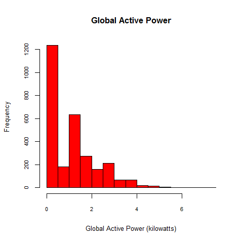
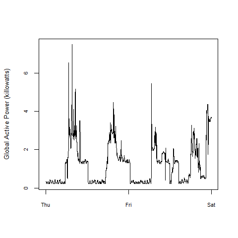
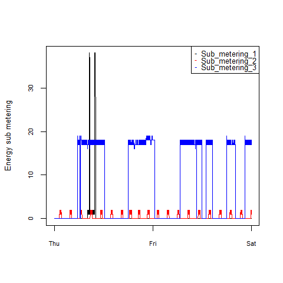
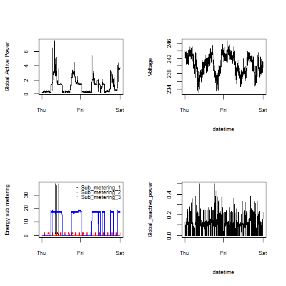

## Introduction

This is my solution for the first assignment of the John Hopkins MOOC
Exploratory Data Analysis.

The four plots that you will need to construct are shown below. Followed
by my own plot.

### Plot 1

 
 

### Plot 2

 
 

### Plot 3

 
 

### Plot 4

 
 

